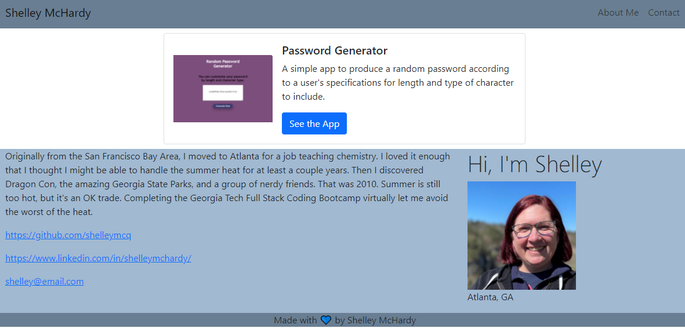

# portfolio-generator
## Licensing:

## Description
This application will allow a user to create a simple portfolio from the command line. The inquirer npm package is used to prompt the user for project details and then an index.html file is generated. 
## Story
I am redoing particularly interesting or challenging class projects from scratch to see how far I've come in my learning to code journey. This particular project was never completed in class, but sounded fun. The original acceptance criteria was a simply designed contact site autogenerated from the command line. I included the functionality to add a single sample project and links to images to bring a little more interest to the page. Next I would like the user to be able to add multiple projects and jazz up the styling a bit.
## Table of Contents
* [Installation](#Installation)
* [Usage](#Usage)
* [Technology](#Technology)
* [Questions](#Questions)
## Installation
Fork this repo and clone it to your computer. Then install inquirer in the appropriate directory.
## Usage
* Run node index.js from the command line to initialize the application. 
* Answer each prompt with all the information you wish to include in your portfolio. 
* After answering the prompts, the index.html file will automatically be generated in the same directory.

## Technology
* HTML
* JavaScript
* nodeJS
* Inquirer
## Questions 
#### Please contact me by email.

https://github.com/shelleymcq or email me at shelleymcq.dev@gmail.com
